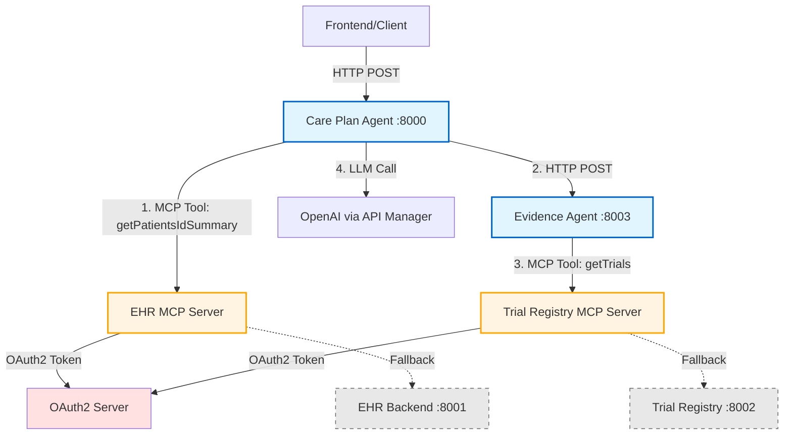

## Request Flow

### 1. Patient Summary Retrieval (Care Plan Agent)

```
┌────────────┐
│   Client   │
└─────┬──────┘
      │ POST /care-plan
      │ {patient_id: "12873", ...}
      ▼
┌──────────────────────────────────────┐
│      Care Plan Agent (:8000)         │
│                                      │
│  fetch_patient_summary()             │
│    ↓                                 │
│  _get_mcp_access_token()             │
│    ↓                                 │
│  _call_mcp_tool(                     │
│    EHR_MCP_URL,                      │
│    "getPatientsIdSummary",           │
│    {"id": "12873"}                   │
│  )                                   │
└──────────────┬───────────────────────┘
               │
               │ POST (MCP Protocol)
               │ Authorization: Bearer {token}
               ▼
┌──────────────────────────────────────┐
│      EHR MCP Server                  │
│                                      │
│  • Validates OAuth2 token            │
│  • Calls EHR Backend                 │
│  • Returns MCP-formatted response    │
└──────────────┬───────────────────────┘
               │
               │ {"jsonrpc": "2.0", "result": {...}}
               ▼
┌──────────────────────────────────────┐
│      Care Plan Agent                 │
│                                      │
│  • Parses MCP response               │
│  • Extracts patient summary          │
│  • Continues with care plan logic    │
└──────────────────────────────────────┘
```

### 2. Trial Data Retrieval (Evidence Agent)

```
┌────────────┐
│   Client   │
│ (Care Plan │
│   Agent)   │
└─────┬──────┘
      │ POST /agents/evidence/search
      │ {age: 68, diagnosis: "...", ...}
      ▼
┌──────────────────────────────────────┐
│      Evidence Agent (:8003)          │
│                                      │
│  fetch_trials()                      │
│    ↓                                 │
│  _get_mcp_access_token()             │
│    ↓                                 │
│  _call_mcp_tool(                     │
│    TRIAL_REGISTRY_MCP_URL,           │
│    "getTrials",                      │
│    {}                                │
│  )                                   │
└──────────────┬───────────────────────┘
               │
               │ POST (MCP Protocol)
               │ Authorization: Bearer {token}
               ▼
┌──────────────────────────────────────┐
│   Trial Registry MCP Server          │
│                                      │
│  • Validates OAuth2 token            │
│  • Queries trial database            │
│  • Returns MCP-formatted response    │
└──────────────┬───────────────────────┘
               │
               │ {"jsonrpc": "2.0", "result": {...}}
               ▼
┌──────────────────────────────────────┐
│      Evidence Agent                  │
│                                      │
│  • Parses MCP response               │
│  • Extracts trials list              │
│  • Scores and ranks trials           │
│  • Returns evidence pack             │
└──────────────────────────────────────┘
```

## OAuth2 Token Flow

```
┌──────────────┐
│    Agent     │
│              │
│ Needs MCP    │
│ Access       │
└──────┬───────┘
       │
       │ 1. Check cache
       │    Token valid?
       ▼
       ├─ Yes ─────────────────────┐
       │                            │
       │ No                         │
       ▼                            │
┌──────────────────┐                │
│  OAuth2 Server   │                │
│                  │                │
│  POST /token     │                │
│  {               │                │
│   grant_type:    │                │
│     "client_...", │               │
│   client_id,     │                │
│   client_secret  │                │
│  }               │                │
└──────┬───────────┘                │
       │                            │
       │ 2. Return token            │
       ▼                            │
┌──────────────────┐                │
│  Cache Token     │                │
│  expires_at =    │                │
│    now + 3600s   │                │
└──────┬───────────┘                │
       │                            │
       ├────────────────────────────┘
       │
       │ 3. Use token
       ▼
┌──────────────────┐
│  MCP Server      │
│  Authorization:  │
│  Bearer {token}  │
└──────────────────┘
```

## Error Handling & Fallback

```
┌─────────────────────────────────────┐
│         Try MCP First               │
└─────────────┬───────────────────────┘
              │
              ▼
         ┌─────────┐
         │ Success?│
         └────┬────┘
              │
    ┌─────────┴─────────┐
    │                   │
   YES                 NO
    │                   │
    ▼                   ▼
┌─────────┐      ┌───────────────┐
│ Return  │      │ Log Warning   │
│  Data   │      └───────┬───────┘
└─────────┘              │
                         ▼
                  ┌──────────────┐
                  │ Try Direct   │
                  │ REST API     │
                  └──────┬───────┘
                         │
                         ▼
                    ┌─────────┐
                    │Success? │
                    └────┬────┘
                         │
                   ┌─────┴─────┐
                   │           │
                  YES         NO
                   │           │
                   ▼           ▼
              ┌─────────┐  ┌──────┐
              │ Return  │  │Error │
              │  Data   │  │ 500  │
              └─────────┘  └──────┘
```

## Sequence Diagram: Complete Care Plan Request

```
Client          Care Plan       OAuth2      EHR MCP      Evidence     Trial MCP
  │                 │             │            │            Agent          │
  │─POST care-plan─>│             │            │              │            │
  │                 │             │            │              │            │
  │                 │─Get Token──>│            │              │            │
  │                 │<─Token──────│            │              │            │
  │                 │                          │              │            │
  │                 │─getPatientsIdSummary────>│              │            │
  │                 │<─Patient Data────────────│              │            │
  │                 │                                         │            │
  │                 │─POST /evidence/search──────────────────>│            │
  │                 │                          │              │            │
  │                 │                          │              │─Get Token─>│
  │                 │                          │              │<─Token─────│
  │                 │                          │              │            │
  │                 │                          │              │─getTrials─>│
  │                 │                          │              │<─Trials────│
  │                 │                          │              │            │
  │                 │<─Evidence Pack───────────────────────────│            │
  │                 │                                         │            │
  │                 │─[Generate Care Plan]                    │            │
  │<─Care Plan─────│                                         │            │
  │                 │                                         │            │
```

## Component Responsibilities

| Component | Responsibility | Port |
|-----------|---------------|------|
| **Care Plan Agent** | Orchestrates care plan generation | 8000 |
| **Evidence Agent** | Searches and ranks clinical trials | 8003 |
| **EHR MCP Server** | Provides patient data via MCP | N/A |
| **Trial Registry MCP** | Provides trial data via MCP | N/A |
| **OAuth2 Server** | Issues access tokens | N/A |
| **EHR Backend** | Direct EHR service (fallback) | 8001 |
| **Trial Registry** | Direct trial service (fallback) | 8002 |

## Data Flow Summary

1. **Client** → Care Plan Agent: Request care plan
2. **Care Plan Agent** → OAuth2: Get MCP token
3. **Care Plan Agent** → EHR MCP: Get patient data
4. **Care Plan Agent** → Evidence Agent: Request evidence
5. **Evidence Agent** → OAuth2: Get MCP token
6. **Evidence Agent** → Trial Registry MCP: Get trials
7. **Evidence Agent** → Care Plan Agent: Return evidence pack
8. **Care Plan Agent** → Client: Return care plan
