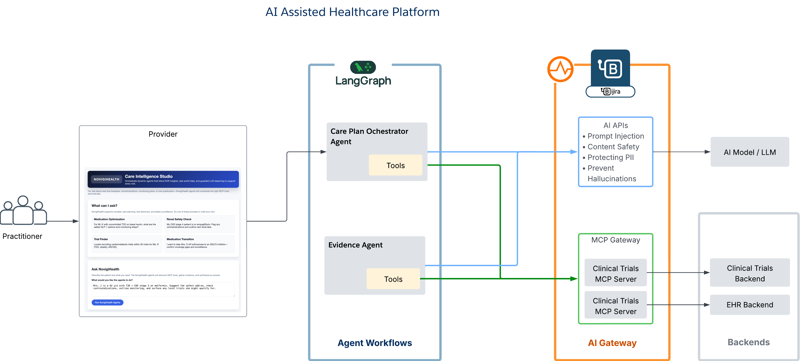

# langgraph-wso2-ai-sample

Minimal workspace containing LangGraph agents plus REST backends for clinical research, EHR, and an accompanying clinician UI.

## Prerequisites
- Python 3.10 or newer (virtual environments recommended)

## Services & Agents
### Trial Registry Service
1. `cp trial-registry-backend/.env.example trial-registry-backend/.env`
2. `pip install -r trial-registry-backend/requirements.txt`
3. `uvicorn app:app --app-dir trial-registry-backend --reload --port 8002`
4. Swagger UI: <http://127.0.0.1:8002/docs>

Endpoints cover `GET /trials`, `POST /trials`, and return structured metadata (NCT id, distance, eligibility summary) for the Evidence Agent.

### EHR Service
1. `cp ehr-backend/.env.example ehr-backend/.env`
2. `pip install -r ehr-backend/requirements.txt`
3. `uvicorn app:app --app-dir ehr-backend --reload --port 8001`
4. Swagger UI: <http://127.0.0.1:8001/docs>

Key routes:
- `GET /patients/{id}/summary`
- `GET /patients/{id}/labs?names=eGFR,A1c&last_n=6` → `{ "patient_id": "12873", "labs": [...] }`
- `POST /orders/medication`

### Evidence Agent
1. `cp evidence-agent/.env.example evidence-agent/.env`
2. `pip install -r evidence-agent/requirements.txt`
3. `uvicorn evidence_agent:app --app-dir evidence-agent --reload --port 8003`

`POST /agents/evidence/search` accepts `{age, diagnosis, egfr, comorbidities, geo}` and returns an `evidence_pack` with ranked trial matches, PICO-style grading, and risk/benefit notes. The agent uses LangGraph to fetch the Trial Registry service and perform the synthetic analysis step.

### Care-Plan Agent
1. `cp care-plan-agent/.env.example care-plan-agent/.env`
2. `pip install -r care-plan-agent/requirements.txt`
3. `uvicorn app:app --app-dir care-plan-agent --reload --port 8004`

`POST /agents/care-plan/recommendation` orchestrates the workflow:
1. `GET /patients/{id}/summary` from the EHR service.
2. `POST /agents/evidence/search` to the Evidence Agent.
3. Mock LLM drafting of a plan card (recommendation, safety, orders, citations, trial matches).

Example request:
```json
{
  "user_id": "dr_patel",
  "patient_id": "12873",
  "question": "Add-on to metformin for T2D with CKD stage 3; show supporting evidence and local recruiting trials."
}
```

### Frontend (Doctor UI)
1. `cd frontend && cp .env.local.example .env.local`
2. (Optional) `cp .env.example .env` for shared tooling or deployment.
3. Update URLs/tokens in the env files as needed (e.g., `CARE_PLAN_URL`, `EHR_URL`, `OPENAI_API_KEY`).
4. `npm install`
5. `npm run dev` (Next.js on <http://127.0.0.1:8080>)

The portal calls the Care-Plan Agent via `/api/care-plan`, fetches labs through `/api/labs`, and offers an evidence preview tab backed by `/api/evidence`.

### Architecture Overview
- **Frontend (Next.js)** – orchestrates the doctor workflow and keeps credentials server-side. It talks only to internal `/api/*` routes.
- **Care-Plan Agent (LangGraph)** – fetches EHR summary ➜ requests the Evidence Agent ➜ invokes an optional LLM node to draft the plan card ➜ merges with guard-rail heuristics before responding.
- **Evidence Agent (LangGraph)** – pulls candidate trials from the Trial Registry ➜ optional LLM node grades relevance (PICO, risk/benefit) ➜ falls back to heuristics when no model is configured.
- **EHR Service** – provides patient summaries, labs, and mock order endpoints.
- **Trial Registry Service** – supplies structured trial data for both the Evidence Agent and UI.

Set `OPENAI_API_KEY` plus optional `OPENAI_MODEL`/`OPENAI_BASE_URL` to enable the LLM nodes. Without these variables the agents happily revert to heuristic logic, keeping local demos self-contained.



## Test the Care-Plan Agent
1. Run the services above (Trial Registry, EHR, Evidence Agent).
2. Trigger the agent: `curl -X POST http://127.0.0.1:8004/agents/care-plan/recommendation \
   -H 'Content-Type: application/json' \
   -d '{"user_id":"dr_patel","patient_id":"12873","question":"Add-on to metformin..."}'`
3. Verify the JSON response contains a `plan_card.recommendation` recommending an SGLT2 inhibitor and two local trial matches.

For ad-hoc checks, run `python care-plan-agent/simple_langgraph.py` to confirm the sample LangGraph loop still operates.

## Start / Stop everything with scripts
- Start: `./start_services.sh` (launches all backends, agents, and the frontend; logs streamed to `logs/<service>.log`).
- Stop: `./stop_services.sh` (gracefully terminates everything and optionally deletes the `logs/` directory).

## FHIR Relevance
- **EHR Service** — could emit FHIR `Patient`, `Condition`, `Observation`, and `MedicationRequest` resources instead of ad-hoc JSON.
- **Trial Registry Service** — trial payloads map cleanly to FHIR `ResearchStudy` / `ResearchSubject` resources, easing Evidence Agent ingestion.
- **Evidence Agent** — can translate graded outputs into `EvidenceReport` or `DocumentReference` resources for system-of-record storage.
- **Care-Plan Agent** — current plan card is JSON but can be expressed as a FHIR `CarePlan` or `ServiceRequest` bundle to plug into downstream EHRs.
- **Frontend** — consumes the REST APIs today, but could directly interact with FHIR endpoints for standards-aligned read/write operations.
